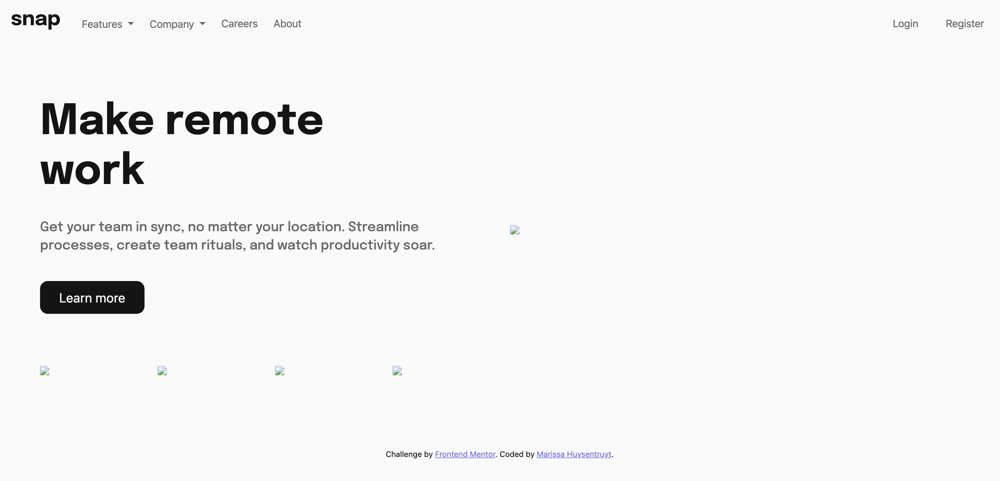
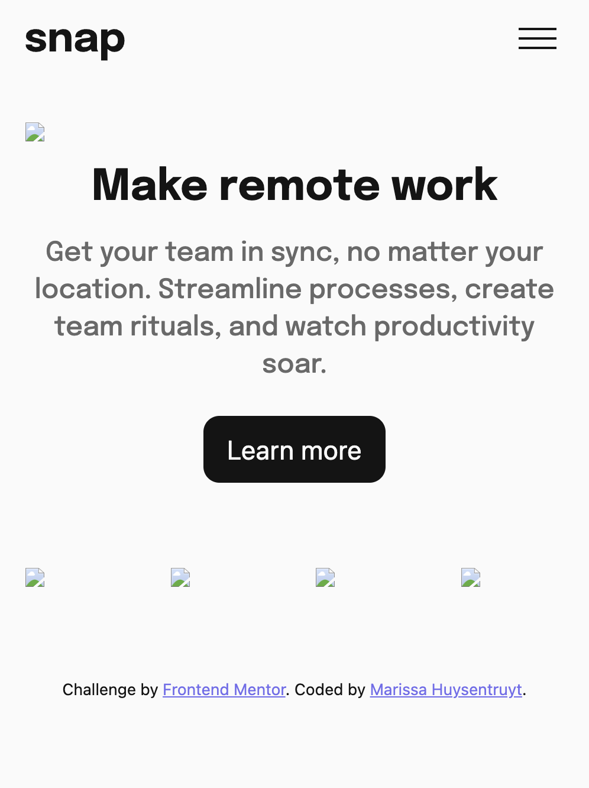
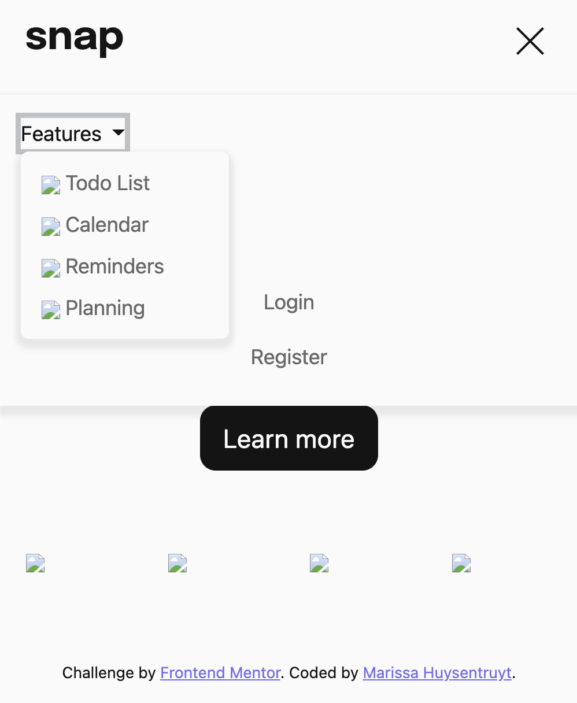

# Frontend Mentor - Intro section with dropdown navigation solution

This is a solution to the [Intro section with dropdown navigation challenge on Frontend Mentor](https://www.frontendmentor.io/challenges/intro-section-with-dropdown-navigation-ryaPetHE5). Frontend Mentor challenges help you improve your coding skills by building realistic projects. 

## Table of contents

- [Welcome & Overview](#welcome-👋)
  - [The challenge](#the-challenge)
  - [Where to find everything](#where-to-find-everything)
  - [Running the Project](#running-the-project)
  - [Deploying the Project](#deploying-the-project)
  - [Screenshots](#screenshots)
  - [Links](#links)
- [My process](#my-process)
  - [Built with](#built-with)
  - [What I learned](#what-i-learned)
  - [Continued development](#continued-development)
  - [Useful resources](#useful-resources)
- [Author](#author)

## Welcome 👋
This challenge is to create a landing page for a site that has dropdown navigation. The dropdowns need to be implemented in both large and small screen devices, which also means that a small screen menu should be implemented. To get experience using Handlebars and Bootstrap, this project uses both. 

### The challenge

Besides creating a site that looks as close to the design as possible, users should be able to:

- View the relevant dropdown menus on desktop and mobile when interacting with the navigation links
- View the optimal layout for the content depending on their device's screen size
- See hover states for all interactive elements on the page

### Where to find everything

If you would like to see the static design files, you may find them in the `design` folder. You'll see both a mobile and a desktop version.

There is also a `style-guide.md` file containing the information regarding the designs, such as color palette and fonts. Additionally, any required assets in the `/images` folder.

The content for the `index.html` page is found within the `context` object in `template.handlebars.js` file. Each data point is incorporated into the object in some way, which will then be outputted in the `index.html` file when the project runs. 

### Running the Project
1. Clone or fork this repo
2. Run `npm install` to get all dependencies
3. Run `npm run start` to open the Webpack server. Webpack will continue to watch for and build changes automatically when you change styles or the Handlebars template.
4. Visit `localhost:8080` to see the dev version of the site
5. Run `npm run lint:js` if you'd like to lint any of the JavaScript files
6. Run `npm run lint:css` if you'd like to lint any of the SCSS files
7. `npm run build` compiles a single instance of the site into a `dist` folder

### Deploying the Project

There are many ways to host your project for free. Recommended hosts are:

- [GitHub Pages](https://pages.github.com/)
- [Vercel](https://vercel.com/)
- [Netlify](https://www.netlify.com/)

You can see my deployed branch via Netlify [here](https://scintillating-torrone-5dc0e6.netlify.app/).

### Screenshots

There are several screenshots here. The first shows the large screen version, then a small screen version, and the last shows the navigation menu open on a small screen device. 

### Links

- First Solution: [Code Solution](https://www.frontendmentor.io/solutions/handlebars-bootstrap-webpack-xkeEWY5owF)
- [Live site](https://scintillating-torrone-5dc0e6.netlify.app/)

## My process

For this project, I made sure to focus on my HTML markup first, getting things semantically in place, then focusing on the JavaScript. The only "styling" I did was when I implemented the Bootstrap dropdown, changing the hover color to a color that is incorporated in the (non-existent) hero image. As you can see, even at this late stage, there is almost no styles done, except for simple typography. 

In my new job, I was informed that my next project would include Handlebars and Bootstrap.js. I hadn't worked in Handlebars in quite some time and didn't have a ton of experience with Bootstrap, so I decided to use this project to incorporate both and try to refresh my memory. The template for `index.html` houses all the data that needs to be displayed on the page. I used a previous project to get the template Handlebars file ready (although now I know more about Handlebars partials & components). 

For `app.js`, I decided that the small screen menu would be a dialog, and followed the suggestions on the [Accessible Components Cheatsheet page](https://accessible-components.sparkbox.com/dialog) for dialog/modal. Most of the functionality is accessible, but the only thing I struggled capturing was the tab focus staying trapped within the menu dialog specifically when users use `shift + tab` to go backwards in the tab order (which, because of that, technically means it isn't an accessible modal). 

The dropdown menus were created with Bootstrap. This was a simple process of making sure I imported the correct Bootstrap CSS & JS, then altered the custom variables to match the project design instead. 

### Built with

- Semantic HTML5 markup
- CSS custom properties
- [SCSS](https://sass-lang.com/documentation/)
- [ITCSS](https://www.xfive.co/blog/itcss-scalable-maintainable-css-architecture/#:~:text=in%20some%20blanks.-,What%20is%20ITCSS%3F,namespace%2C%20cascade%20and%20selectors%20specificity)
- [BEM naming practice](https://en.bem.info/methodology/quick-start/)
- Flexbox
- CSS Grid
- Mobile-first workflow
- [Handlebars.js](https://handlebarsjs.com/guide/)
- [Bootstrap dropdown](https://getbootstrap.com/docs/5.3/components/dropdowns/)
- [Webpack](https://webpack.js.org/concepts/)
- Linters: [Stylelint](https://stylelint.io/), [ESLint](https://eslint.org/docs/latest/), [Prettier](https://github.com/prettier/eslint-plugin-prettier)

### What I learned

Unfortunately, the biggest thing I learned was that the Handlebars documentation leaves quite a bit to be desired. I spent much more time Googling and searching for answers about Handlebars than I spent searching the docs. 

I was, however, able to get Webpack and Handlebars to "play nicely" for the most part. The hot module replacement works really well in this project (in some of my other projects, it doesn't really work), and I was able to get a working template built for all of the content that needed to be on the page. I had to refactor the template several times in order to get the data where it needed to be, but I'm happy with the results overall. 

### Continued development

Because the Handlebars docs are a little hard to use, I am having trouble making sure that my image paths are correct. I can't get my Handlebars paths to match and compile properly after Webpack builds the project. 

I decided with this first solution to use vanilla JS to create the small screen menu, but I'd love to revisit this project and use the [Bootstrap offcanvas](https://getbootstrap.com/docs/5.3/components/offcanvas/) component, almost purely because I find the animation aesthetically pleasing. 

Additionally, I left a note for myself in `app.js` to write JavaScript to determine whether or not to display the small screen navigation. If the screen resizes after a user has already interacted with the small screen nav, the hamburger SVG continues to show, blocking the large screen navigation. This only happens if interaction occurs on a small screen, then the screen increases in size. 

### Useful resources

Although I still got stuck, referencing the [Handlebars.js](https://handlebarsjs.com/guide/) proved useful. I hadn't used Handlebars in quite some time, and wanted to get a little more experience with it, since I knew my next project at work would incorporated Handlebars. The documentation isn't anywhere near complete nor super clear for a newcomer, but it got me started and I was able to Google and search for the other answers I needed. 

In contrast, the [Bootstrap](https://getbootstrap.com/docs/5.3/getting-started/introduction/) docs are quite thorough. Everything is nicely organized and searchable. I loved having working examples of the components I wanted to use first, that way I could decide after some experimentation if that was really the component that suited the job. 

## Author

- Website - [Marissa Huysentruyt](https://www.marissahuysentruyt.com)
- Frontend Mentor - [@marissahuysentruyt](https://www.frontendmentor.io/profile/marissahuysentruyt)
